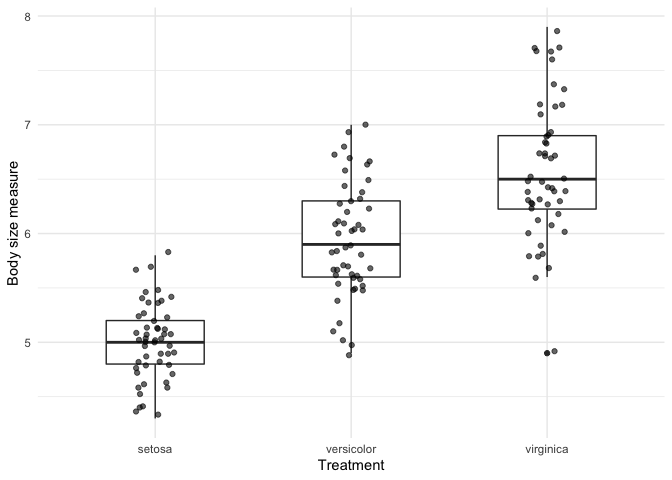

<!-- README.md is generated from README.Rmd. Please edit that file -->

# quickanalysis

<!-- badges: start -->
<!-- badges: end -->

The goal of quickanalysis is quickly analyze any measured numeric
variable across multiple treatments, and want a quick summary statistics
and visualization of the data. The `box_and_stats()` function provides
fast summary statistics (min, max, mean, median, standard deviation) of
the measured variable for each treatment, along with a boxplot which
displays the data visually.

## Installation

quickanalysis is not on CRAN, but you can download it from my github
repository. Use the follwoing R command to download it:

``` r
 devtools::install_github("marquenis/quickanalysis") 
```

## Example

This is a basic example of how the package works using the built in R
dataset: iris. This dataset contains a measured variable (Sepal.length)
across multiple categorical treatments (in this case, species).

By running this function we can see the maximum, minimum, mean, median,
and standard deviation of the sepal length of the flowers, grouped by
their different species.

It also creates a boxplot that lets us visually see the distribution of
sepal length grouped by species. From this quick boxplot we can see that
different species have different sepal lengths, and conduct further
statistical analyses.

``` r
library(quickanalysis)

box_and_stats(iris, Species, Sepal.Length)
#> [[1]]
```



    #> 
    #> [[2]]
    #> # A tibble: 3 × 6
    #>   fun_treatment   min   max  mean median    SD
    #>   <fct>         <dbl> <dbl> <dbl>  <dbl> <dbl>
    #> 1 setosa          4.3   5.8  5.01    5   0.352
    #> 2 versicolor      4.9   7    5.94    5.9 0.516
    #> 3 virginica       4.9   7.9  6.59    6.5 0.636

This package is special because all those analysis can be completed just
by loading the package and running a single line of code.

## Notes

Please be aware that this package relies on the following 3 packages for
internal coding use: 1. dplyr 2. ggplot2 3. magittr
